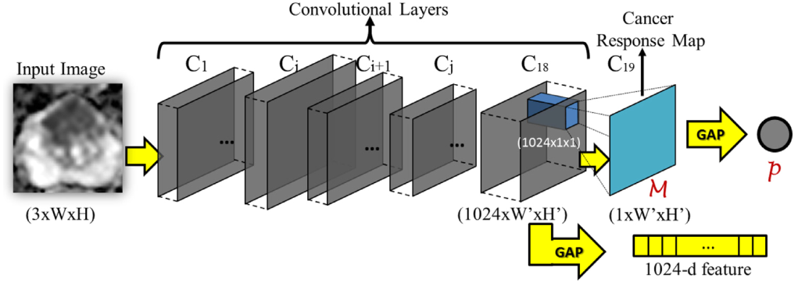

# Sample code for the prostate cancer localization
### Introduction

We propose a co-trained prostate cancer localization framework for prostate cancer localization with a weakly supervised multi-modal network. It highlights the most informative regions relevant to the predicted prostate cancer class. You could get attention-based model instantly by tweaking your own CNN a little bit more. The paper is published at MIA'17.

The framework of the prostate cancer localization is as below:



Some predicted prostate activation maps for cancer region are:


### Citing co-trained multi-modal in your publications if it helps your research:
```
@article{yang2017co,
  title={Co-trained convolutional neural networks for automated detection of prostate cancer in multi-parametric MRI},
  author={Yang, Xin and Liu, Chaoyue and Wang, Zhiwei and Yang, Jun and Le Min, Hung and Wang, Liang and Cheng, Kwang-Ting Tim},
  journal={Medical image analysis},
  volume={42},
  pages={212--227},
  year={2017},
  publisher={Elsevier}
}
```

### Usage Instructions:
* Install [caffe](https://github.com/BVLC/caffe), compile the matcaffe (matlab wrapper for caffe), and make sure you could run the prediction example code classification.m.
* Clone the code from Github:
* Run the demo code to generate the heatmap in matlab terminal
* create lmdb
```
cd models
ipython notebook main.ipynb
```
* train
```
python models/solveCAM_cov_loss_min.py
```
* eval in matlab terminal
```
evaluationdualloss.m
```
* get feature in matlab terminal
```
featureextractloss.m
```

### Pre-trained Models:
```
cd model
```
    
